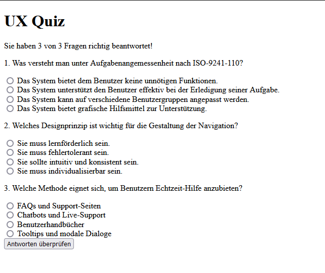

# Learning Website for Module 322 - Second Exam

This is a learning website I created for the second smaller exam in Module 322 during my apprenticeship as a Software Engineer. The website helps to review and understand the key learning objectives of the module.

## Features
- Multiple-choice quizzes
- Key learning objective summaries
- Interactive learning

## Screenshot


## How to Access the Website
Follow these steps to run the website on your local machine:

1. **Download and Install XAMPP** (if not already installed):
   - [Download XAMPP](https://www.apachefriends.org/index.html)

2. **Start Apache in XAMPP**:
   - Open the XAMPP Control Panel and click on Start for Apache.

3. **Copy Project Files**:
   - Move all PHP files to the folder:
     ```
     C:\xampp\htdocs
     ```

4. **Run the Website in Browser**:
   - Open your web browser and enter:
     ```
     http://localhost/FILENAME_IN_HTDOCS
     ```